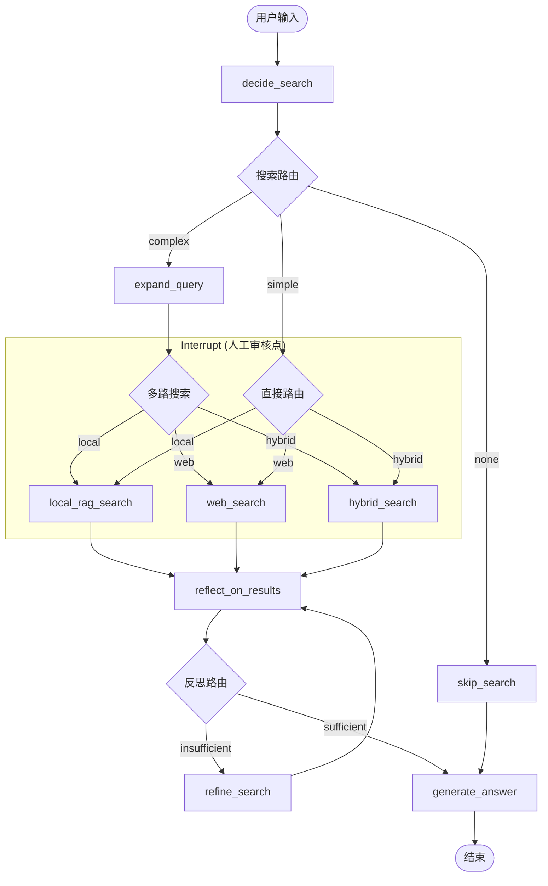

# 🔍 Smart Search Assistant

基于 LangGraph 的 **Agentic RAG** 智能搜索助手，集成多轮对话、本地知识库、网络搜索、反思循环、Multi-Query 扩展等高级功能。

## ✨ 核心功能

| 功能 | 描述 |
|------|------|
| 🤖 **智能路由** | 自动判断搜索类型：本地知识库 / 网络搜索 / 混合搜索 |
| 📚 **本地 RAG** | 支持 PDF、TXT、Markdown 文档，Hybrid Search + Rerank |
| 🔄 **反思循环** | Reflector 节点评估检索质量，自动改进查询并重试 |
| 🔍 **Multi-Query** | 查询扩展，提高检索召回率 |
| 💬 **多轮对话** | 上下文理解、代词解析、查询改写 |
| 🌐 **流式输出** | SSE 实时显示执行进度 |
| 🔌 **RESTful API** | FastAPI 接口，支持 Docker 部署 |
| 🖥️ **Web UI** | Streamlit 可视化界面 |

## 🎯 技术亮点

### 1. Agentic RAG 核心架构



- **Reflector (反思机制)**: LLM 实时评估检索结果是否足以回答问题，确保输出质量。
- **Auto-Refinement (自动优化)**: 结果不足时自动生成改进后的 Query 并重新检索（支持多轮循环）。
- **Multi-Query (查询扩展)**: 自动将复杂问题拆解/扩展为多个相关子查询，极大提升检索召回率。
- **Human-in-the-Loop (人工干预)**: 在任何实际搜索动作前强制暂停（Interrupt），允许人工预览或干预。

### 2. 混合检索 (Hybrid Search)

```python
# 向量相似度 + BM25 关键词匹配
final_score = vector_weight * vector_score + (1 - vector_weight) * bm25_score
```

- 向量检索：捕捉语义相似性
- BM25：精确匹配关键词
- Rerank：CrossEncoder 重排序，提高精度

### 3. Human-in-the-Loop

支持在敏感操作前暂停，等待用户确认：
```python
# 在搜索节点前设置 interrupt
workflow.compile(
    checkpointer=memory,
    interrupt_before=["local_rag", "web_search", "hybrid_search"]
)
```

## 🚀 快速开始

### 1. 安装依赖

```bash
pip install -r requirements.txt
```

### 2. 配置环境变量

```bash
cp .env.example .env
# 编辑 .env 文件:
# DASHSCOPE_API_KEY=your_key_here
# TAVILY_API_KEY=your_key_here (可选)
```

### 3. 运行方式

**CLI 模式（推荐入门）:**
```bash
python -m src.graph_advanced
```

**Web UI:**
```bash
streamlit run src/ui/streamlit_app.py
```

**API 服务:**
```bash
uvicorn src.api.server:app --reload --port 8000
```

**Docker 部署:**
```bash
docker-compose up -d
```

## 📖 使用示例

### 基础用法

```python
from src.graph_advanced import ask

# 简单问答
result = ask("什么是 LangGraph？")
print(result["answer"])
print(result["sources"])  # 来源追溯
```

### 导入文档

```python
from src.rag.rag_manager import RAGManager

rag = RAGManager.get_instance()

# 添加单个文档
rag.add_document("./data/knowledge/doc.pdf")

# 批量导入目录
rag.add_documents_from_dir("./data/knowledge/")

# 查看已导入文档
print(rag.list_documents())
```

### API 调用

```python
import requests

# 普通问答
response = requests.post("http://localhost:8000/ask", json={
    "query": "什么是 RAG？",
    "use_multi_query": True,
    "max_loops": 3
})
print(response.json())

# 上传文档
with open("doc.pdf", "rb") as f:
    response = requests.post(
        "http://localhost:8000/documents",
        files={"file": f}
    )
```

## 🏗️ 项目结构

```
smart-search-assistant/
├── src/
│   ├── api/                    # FastAPI 服务
│   │   └── server.py           # RESTful API + SSE
│   ├── evaluation/             # 评估模块
│   │   └── rag_evaluator.py    # RAG 质量评估
│   ├── rag/                    # RAG 核心模块
│   │   ├── config.py           # RAG 配置
│   │   ├── document_loader.py  # 文档加载器
│   │   ├── vector_store.py     # 向量存储 (ChromaDB)
│   │   ├── retriever.py        # 混合检索器
│   │   └── rag_manager.py      # RAG 管理器
│   ├── ui/                     # Web UI
│   │   └── streamlit_app.py    # Streamlit 界面
│   ├── utils/                  # 工具模块
│   │   └── retry.py            # 重试/熔断机制
│   ├── config.py               # 全局配置
│   ├── state.py                # State 定义
│   ├── tools.py                # 搜索工具
│   ├── nodes.py                # 节点函数
│   ├── graph.py                # 基础 Graph
│   ├── graph_with_interrupt.py # Human-in-the-loop Graph
│   └── graph_advanced.py       # 高级 Graph (推荐入口)
├── data/
│   ├── knowledge/              # 知识库文档
│   └── vector_db/              # 向量数据库 (持久化)
├── checkpoints/                # 对话状态持久化
├── Dockerfile
├── docker-compose.yml
├── requirements.txt
└── README.md
```

## 🔧 配置说明

### 核心配置 (`src/config.py`)

| 配置项 | 说明 | 默认值 |
|--------|------|--------|
| `MODEL_NAME` | LLM 模型 | `qwen-plus` |
| `EMBEDDING_MODEL` | 向量嵌入模型 | `shibing624/text2vec-base-chinese` |
| `RERANK_MODEL` | 重排序模型 | `BAAI/bge-reranker-base` |
| `CHUNK_SIZE` | 文档切分大小 | `500` |
| `VECTOR_SEARCH_TOP_K` | 向量检索数量 | `20` |
| `RERANK_TOP_N` | Rerank 后保留数量 | `5` |
| `VECTOR_WEIGHT` | 向量权重 | `0.6` |

## 📊 技术栈

| 类别 | 技术 |
|------|------|
| **工作流** | LangGraph |
| **LLM** | 通义千问 (via 阿里云百炼) |
| **向量库** | ChromaDB (持久化) |
| **Embedding** | text2vec-base-chinese |
| **Rerank** | BGE-Reranker |
| **搜索** | Tavily API |
| **API** | FastAPI + SSE |
| **UI** | Streamlit |
| **部署** | Docker |

## 🎓 核心概念

### State 状态管理

```python
class AgentState(TypedDict):
    messages: List[BaseMessage]     # 对话历史
    current_query: str              # 当前问题
    search_type: str                # 搜索类型: local/web/hybrid/none
    local_contexts: str             # 本地检索结果
    search_results: str             # 网络搜索结果
    sources: List[dict]             # 来源追溯
    reflection_result: str          # 反思结果
    loop_count: int                 # 循环次数
    expanded_queries: List[str]     # 扩展查询
```

### 节点函数

| 节点 | 功能 |
|------|------|
| `decide_search` | 判断搜索类型 |
| `expand_query` | Multi-Query 扩展 |
| `local_rag_search` | 本地知识库检索 |
| `search_web` | 网络搜索 |
| `hybrid_search` | 混合搜索 |
| `reflect_on_results` | 反思评估 |
| `refine_search` | 改进搜索 |
| `generate_answer` | 生成答案 |

## 📈 RAG 评估

使用 LLM-as-a-Judge 方法评估 RAG 质量：

```bash
python -m src.evaluation.rag_evaluator
```

评估指标：
- **Faithfulness**: 答案是否忠实于检索内容
- **Answer Relevancy**: 答案与问题的相关性
- **Context Precision**: 检索精确度
- **Context Recall**: 检索召回率

## 🧪 测试

```bash
# 运行所有测试
pytest tests/ -v

# 测试 RAG 功能
python -m src.examples.rag_demo

# 测试 Interrupt 功能
python -m src.examples.interrupt_demo
```

## 📝 功能完成度

### 已完成 ✅
- [x] 基础搜索功能
- [x] 多轮对话 + 查询改写
- [x] 流式输出
- [x] SQLite 持久化
- [x] 本地 RAG (Hybrid Search + Rerank)
- [x] 向量库持久化
- [x] 文档去重
- [x] Human-in-the-loop (Interrupt)
- [x] Reflector 反思 + 循环
- [x] Multi-Query 扩展
- [x] 容错/重试机制
- [x] FastAPI + SSE
- [x] RAG 评估脚本
- [x] Streamlit UI
- [x] Docker 部署

### 扩展方向 📌
- [ ] 多模态支持 (图片理解)
- [ ] 更多文档格式 (Word, Excel)
- [ ] 知识图谱集成
- [ ] Agent 协作 (Multi-Agent)

## 🤝 贡献

欢迎提交 Issue 和 Pull Request！

## 📄 License

MIT

## 👤 作者

毕宿五 - AI 研究生 @ 北京信息科技大学

## 🔗 相关链接

- [LangGraph 文档](https://langchain-ai.github.io/langgraph/)
- [ChromaDB](https://www.trychroma.com/)
- [Streamlit](https://streamlit.io/)
- [FastAPI](https://fastapi.tiangolo.com/)
